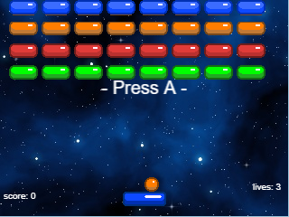
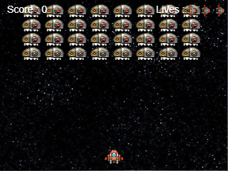
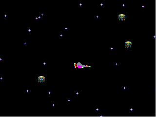
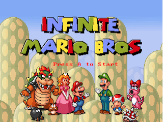
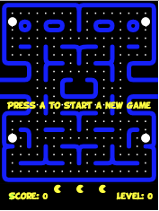

# GSPGames
    


GameShell-Phaser Games repo. Phaser.io games ported to work on GameShell via [GSPLauncher](https://github.com/pleft/GSPLauncher)

## Introduction
This repository contains Phaser.io games ported to work on GameShell. Porting is required for adjusting to the screen resolution of GameShell which is 320x240 pixels. This require to also adjust the playfield and the sprites/assets resolution (mostly by scaling them down) and changing the coordinates of the screen they render to. Apart from this, game controls also need adjusting. GameShell's gamepad is detected as keyboard and this makes it very easy to map it's buttons.

## List of ported games
*  [Breakout](https://phaser.io/examples/v2/games/breakout) 
*  [Defender](https://phaser.io/examples/v2/games/defender)
*  [Invaders](https://phaser.io/examples/v2/games/invaders)
*  [Infinite Mario](https://github.com/robertkleffner/mariohtml5)
*  [Pacman](https://github.com/daleharvey/pacman)

## Porting guidelines

### File/Folder structure
The games are loaded by GSPLauncher which runs on `nwjs`. The only requirement is that the game should have an `index.html` file as a starting point like the following:

#### index.html
```html
<!DOCTYPE html>
<html>
<head>
    <link href="reset.css" rel="stylesheet" type="text/css"/>
    <script src="phaser.min.js"></script>
</head>
<body>
    <script src="game.js"></script>
</body>
</html>
```


### ~~Scree~~
~~GameShell's screen is 320x240 pixels, however initializing the game to the exact screen's size will result to the appearance of scrollbars. So it is set 2-pixels lower, 318x238.~~

```javascript
var game = new Phaser.Game(318, 238, Phaser.CANVAS, '', { preload: preload, create: create, update: update });
```

### Controls
GameShell maps its buttons to keyboard keys. This makes our lives easier and it is pretty straightforward to map GameShell's buttons to phaser.io keys

* `UP = Phaser.Keyboard.UP`
* `DOWN = Phaser.Keyboard.DOWN`
* `LEFT = Phaser.Keyboard.LEFT`
* `RIGHT = Phaser.Keyboard.RIGHT`
* `A = Phaser.Keyboard.J`
* `B = Phaser.Keyboard.K`
* `X = Phaser.Keyboard.U`
* `Y = Phaser.Keyboard.I`
* `MENU = Phaser.Keyboard.ESC`
* `START = Phaser.Keyboard.ENTER`
* `SELECT = Phaser.Keyboard.SPACEBAR`

### Exiting the game and return to GSPLauncher
Since the games are launced from GSPLauncher application, ported games should provide a means of exiting the current game and return to the launcher application. To achieve this we map the `MENU` button to load the launcher application while destroying the current game.

In the game's source js code:

Declare a global variable to hold the `MENU` button (place this on top of the game's source code):
```javascript
var escKey;
```

Inside `create()` method:
```javascript
escKey = game.input.keyboard.addKey(Phaser.Keyboard.ESC);
```

Inside `update()` method:
```javascript
if (this.escKey.isDown) {
  game.pendingDestroy = true;
  window.location.replace('../launcher.html');
}
```

### menu.json
`menu.json` holds the info which GSPLauncher needs to load the games' menu. Upon adding a new game to the repo, `menu.json` should be modified accordingly.

```json
{
    "games": [{
            "title": "Breakout",
            "directory": "breakout/"
        },
        {
            "title": "Defender",
            "directory": "defender/"
        },
        {
            "title": "Invaders",
            "directory": "invaders/"
        },
        {
            "title": "Infinite Mario",
            "directory": "mario/"
        }
    ]
}
```

## Contribution
Feel free to contribute to this repo. Please follow the guidelines so all ported games have the same behavior. I will gladly merge your contributions to the repo.
