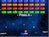
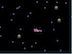
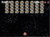

# GSP: GameShell-Phaser
    

Central repository for [GSPLauncher](GSPLauncher/README.md), [GSPGames](GSPGames/README.md).

## Installation

1. Login via `ssh` to GameShell
2. Clone this repository in `/home/cpi`
   ```bash
    git clone https://github.com/pleft/GSP.git
   ```
3. `cd` into the `GSP/` directory and run:
   ```bash
    chmod +x gsp-installer.sh gsp-updater.sh
    ```
    and then
    ```bash
    ./gsp-installer.sh
    ```
4. If no errors appear, reboot GameShell and start the launcher by selecting the 

     menu item.

## Updating

To update to the latest GSP code, simply perform a `git pull` on the `master` branch. For those who are not familiar with `git`, just execute `./gsp-updater.sh` script found inside the `GSP/` direcrory from `ssh`. Just have in mind that any **local changes** will be **lost**.

## Miscellaneous

### Debugging
The shortcut script has been updated to expose the `nwjs` debugging port (9222). This can be usefull to troubleshoot problems and also to help developing on the actual GameShell. To access the debugger all is needed is `Google Chrome` to open a `url` in the form `http://GAMESHELL_IP:9222` and Chrome's developing tools will fire up. **However** it is not so easy since the GameShell's OS does not expose port 9222 to the public. So here comes `ssh` to the rescue. More specifically an `ssh tunneling` is needed. It is very simple, from the **host** computer open a terminal and type:

```bash
ssh -L 9090:localhost:9222 cpi@GAMESHELL_IP
```

where `GAMESHELL_IP` is the ip assigned to GameShell e.g. `192.168.1.100`. Then the terminal will ask for credentials and upon giving the correct, on the **host** computer fire up Chrome and enter the following url: `http://localhost:9090`. Data on GameShell's port `9222` are transfered through `ssh` to the host's local port `9090`. Happy Debugging!

